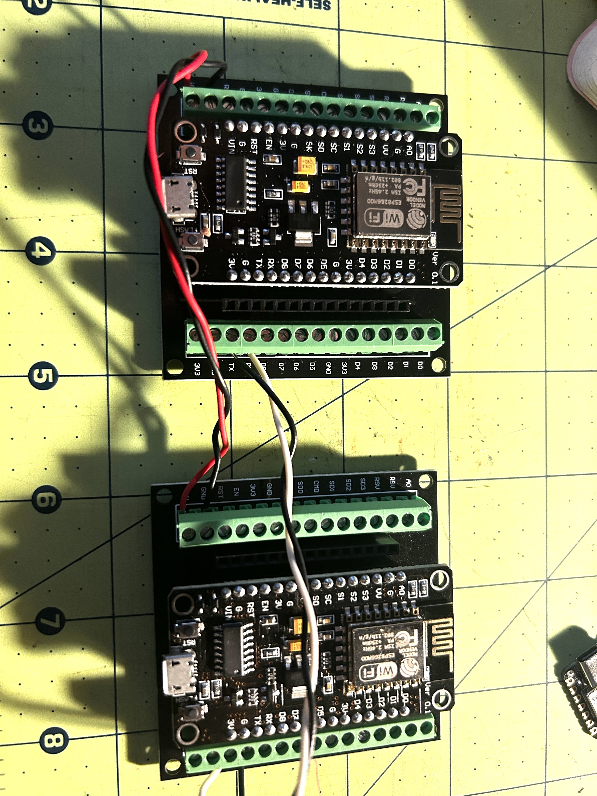
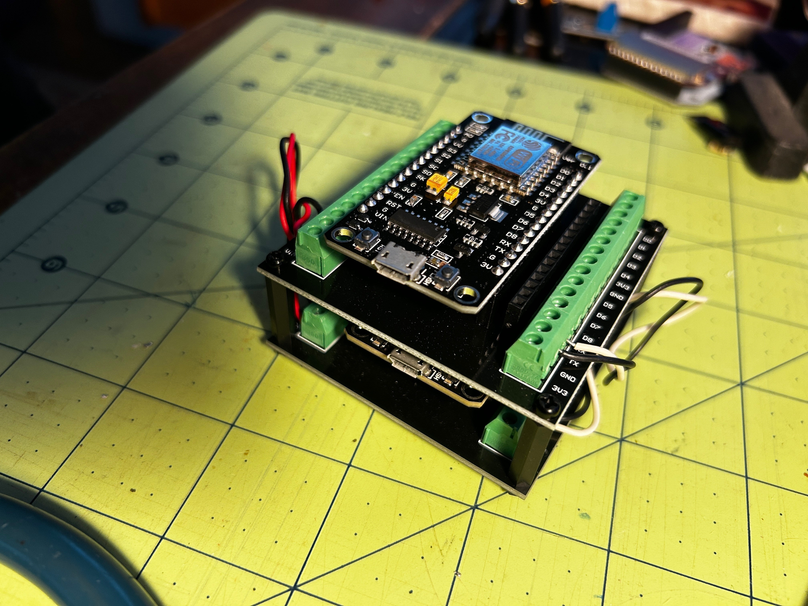

# ESP-NOW to WiFi/MQTT Bridge

I wanted to move my weather station and other devices off my house wifi. It just seems that every month or so I'm adding yet another device to my wifi. To reduce the attack surface, I decided to move my home weather station and other μcontroller controller devices to ESP-NOW.
This means I need some way to bridge ESP-NOW to my homelab. Most of my μcontroller projects use a MQTT server on my Kubernetes cluster. This is the bridge from ESP-NOW ==> WiFi ==> MQTT.

## Why ESP8266? Aren't they old?
Yes, I prefer the ESP32. But I had several ESP8266 boards laying around with nothing better to do. So I put them to work with this task.

## Overview

This project enables reliable communication between ESP-NOW devices and MQTT brokers by using two separate ESP8266 boards connected via serial. One board handles ESP-NOW communication while the other manages WiFi/MQTT, solving the channel conflict issue inherent in single-board ESP8266 implementations.

### Why Two Boards?

The ESP8266 cannot reliably run ESP-NOW and WiFi simultaneously on different channels. This dual-board architecture completely eliminates channel conflicts by dedicating each board to a single protocol.

## Architecture

```
ESP-NOW Device -> Board 1 (ESP-NOW) -> Serial -> Board 2 (WiFi) -> MQTT Broker
                                                                      |
ESP-NOW Device <- Board 1 (ESP-NOW) <- Serial <- Board 2 (WiFi) <- MQTT Broker
```

### Board 1: ESP-NOW Bridge
- Handles all ESP-NOW communication
- No WiFi connection
- Operates in broadcast mode (`FF:FF:FF:FF:FF:FF`)
- Forwards received ESP-NOW messages to serial
- Transmits serial data via ESP-NOW

### Board 2: WiFi/MQTT Bridge
- Handles WiFi and MQTT communication
- No ESP-NOW functionality
- Parses serial data and publishes to MQTT as JSON
- Forwards MQTT messages to serial for ESP-NOW transmission

## Hardware Requirements

- 2x ESP8266 boards (NodeMCU v2 or similar)
- USB cables for programming
- 3x jumper wires (TX, RX, GND)
- Optional: External 5V power supply for production deployment

### Wiring

```
Board 1 (ESP-NOW)        Board 2 (WiFi/MQTT)
    TX (GPIO1)      ---->     RX (GPIO3)
    RX (GPIO3)      <----     TX (GPIO1)
    GND             ----      GND
```





**Note**: TX/RX pins are shared with USB serial. During development, you can only monitor one board at a time via USB. For production, power both boards externally and disconnect USB.

## Software Requirements

- [PlatformIO](https://platformio.org/) (VSCode extension or CLI)
- ESP8266 Arduino framework (automatically installed by PlatformIO)

### Dependencies

The following libraries are automatically installed by PlatformIO:

- **WiFi Bridge**: PubSubClient (MQTT), ArduinoJson
- **ESP-NOW Bridge**: ESP8266 core libraries

## Installation

1. Clone this repository:
```bash
git clone https://github.com/yourusername/esp-now2wifi2mqtt.git
cd esp-now2wifi2mqtt
```

2. Configure WiFi and MQTT settings in `src/wifi_bridge.cpp`:
```cpp
const char* ssid = "YOUR_WIFI_SSID";
const char* password = "YOUR_WIFI_PASSWORD";
const char* mqtt_server = "YOUR_MQTT_BROKER";
const int mqtt_port = 1883;
```

3. Build and upload firmware to both boards:

```bash
# Build and upload to Board 1 (ESP-NOW)
pio run -e espnow-bridge -t upload

# Build and upload to Board 2 (WiFi/MQTT)
pio run -e wifi-bridge -t upload
```

4. Connect the boards via TX/RX/GND wires

5. Monitor serial output (optional):
```bash
pio device monitor
```

## Usage

### MQTT Topics

- `espnow/from_device`: Receives JSON messages from ESP-NOW devices
- `espnow/to_device`: Send messages to ESP-NOW network (raw text)

### Message Format

**From ESP-NOW to MQTT** (JSON):
```json
{
  "mac": "AA:BB:CC:DD:EE:FF",
  "data": "message data here",
  "len": 25
}
```

**To ESP-NOW from MQTT** (raw text):
```
message data here
```

### Serial Protocol

**Board 1 to Board 2**:
```
AABBCCDDEEFF|025|message data here\n
```
Format: `MAC_ADDRESS|LENGTH|DATA\n`

**Board 2 to Board 1**:
```
message data\n
```
Format: Plain text with newline

## Configuration

### Serial Settings
- Baud rate: 115200 (defined in `SERIAL_BAUD`)
- Data limit: 250 bytes per message (`MAX_DATA_SIZE`)

### MQTT Settings
- Max packet size: 512 bytes (`MQTT_MAX_PACKET_SIZE`)
- Keepalive: 30 seconds (`MQTT_KEEPALIVE`)

## Development

### Build Commands

```bash
# Build specific environment
pio run -e espnow-bridge
pio run -e wifi-bridge

# Upload firmware
pio run -e espnow-bridge -t upload
pio run -e wifi-bridge -t upload

# Upload and monitor
pio run -e wifi-bridge -t upload -t monitor

# Clean build files
pio run -t clean
```

### Project Structure

```
esp-now2wifi2mqtt/
├── src/
│   ├── espnow_bridge.cpp    # Board 1: ESP-NOW handler
│   └── wifi_bridge.cpp      # Board 2: WiFi/MQTT handler
├── platformio.ini           # PlatformIO configuration
├── CLAUDE.md               # AI assistant instructions
└── README.md               # This file
```

## License

MIT License - feel free to use and modify for your projects.

